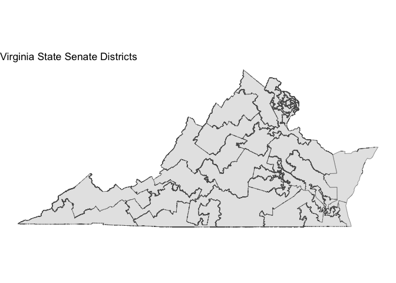
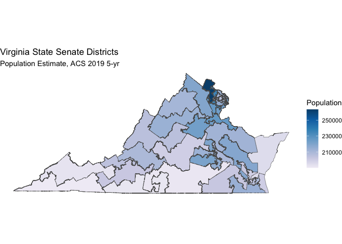

Getting Data
================

## Types of Data

For this project we will need:

  - Census Data: to count populations in areas
  - Shapefiles (also can be from Census): to compute the geometric
    measures
  - State-level election data: precinct vote counts, also shapefiles

### Census Data

The [tidycensus](https://walker-data.com/tidycensus/) package is an
interface to the Census API that gets data in a
[tidy](https://vita.had.co.nz/papers/tidy-data.pdf) way. The intro
vignette to the package is
[here](https://walker-data.com/tidycensus/articles/basic-usage.html).

1.  Get an API key from
    [here](https://api.census.gov/data/key_signup.html)
2.  Install a couple packages:

<!-- end list -->

``` r
install.packages(c("tidyverse", "tidycensus", "usethis")) 
```

3.  Add the API key emailed to you to your `.Renviron` file. To open
    this file, run:

<!-- end list -->

``` r
usethis::edit_r_environ()
```

On a new line in the .Renviron file, put:

``` r
CENSUS_API_KEY="yourkeyhere"
```

4.  Restart R. (Session -\> Restart R)
5.  Run the following:

<!-- end list -->

``` r
library(tidyverse)
library(tidycensus)

census_api_key(Sys.getenv("CENSUS_API_KEY"), install = TRUE)
```

6.  Now you can use `tidycensus`\!

#### Variables

The Census records a whole lotta variables, and `tidycensus` has a way
to search for them:

``` r
v19 <- load_variables(2019, "acs5", cache = TRUE)
View(v19)
```

The 2019 ACS data was just released\!

Use this call to get total population in the state legislative districts
of Virginia in 2019 5-year ACS data.

``` r
pop_var <- "B01003_001"
pop_st_leg <- get_acs(geography = "state legislative district (upper chamber)",
                       variables = c(total_pop = pop_var),
                       state="VA", 
                       year = 2019)
```

    ## Getting data from the 2015-2019 5-year ACS

``` r
head(pop_st_leg)
```

    ## # A tibble: 6 x 5
    ##   GEOID NAME                                     variable  estimate   moe
    ##   <chr> <chr>                                    <chr>        <dbl> <dbl>
    ## 1 51001 State Senate District 1 (2018), Virginia total_pop   202074  2341
    ## 2 51002 State Senate District 2 (2018), Virginia total_pop   198956  2191
    ## 3 51003 State Senate District 3 (2018), Virginia total_pop   218574  1503
    ## 4 51004 State Senate District 4 (2018), Virginia total_pop   211840  1573
    ## 5 51005 State Senate District 5 (2018), Virginia total_pop   205588  2726
    ## 6 51006 State Senate District 6 (2018), Virginia total_pop   194890  1872

### Shapefiles

The [`tigris`](https://github.com/walkerke/tigris) package will allow us
to directly query the TIGER/Line shapefiles from the Census Bureau.

1.  Install some packages:

<!-- end list -->

``` r
install.packages(c('tigris', 'sf'))
```

2.  
<!-- end list -->

``` r
library(tigris)
```

    ## To enable 
    ## caching of data, set `options(tigris_use_cache = TRUE)` in your R script or .Rprofile.

``` r
library(sf)
```

    ## Linking to GEOS 3.7.2, GDAL 2.4.2, PROJ 5.2.0

``` r
va_st_leg <- state_legislative_districts(state = "VA", 
                            house = "upper", 
                            year = 2019)
```

    ## Downloading: 16 kB     Downloading: 16 kB     Downloading: 16 kB     Downloading: 16 kB     Downloading: 25 kB     Downloading: 25 kB     Downloading: 25 kB     Downloading: 25 kB     Downloading: 25 kB     Downloading: 25 kB     Downloading: 25 kB     Downloading: 25 kB     Downloading: 25 kB     Downloading: 25 kB     Downloading: 25 kB     Downloading: 25 kB     Downloading: 41 kB     Downloading: 41 kB     Downloading: 41 kB     Downloading: 41 kB     Downloading: 41 kB     Downloading: 41 kB     Downloading: 41 kB     Downloading: 41 kB     Downloading: 49 kB     Downloading: 49 kB     Downloading: 49 kB     Downloading: 49 kB     Downloading: 59 kB     Downloading: 59 kB     Downloading: 59 kB     Downloading: 59 kB     Downloading: 65 kB     Downloading: 65 kB     Downloading: 65 kB     Downloading: 65 kB     Downloading: 65 kB     Downloading: 65 kB     Downloading: 65 kB     Downloading: 65 kB     Downloading: 65 kB     Downloading: 65 kB     Downloading: 65 kB     Downloading: 65 kB     Downloading: 65 kB     Downloading: 65 kB     Downloading: 65 kB     Downloading: 65 kB     Downloading: 65 kB     Downloading: 65 kB     Downloading: 81 kB     Downloading: 81 kB     Downloading: 88 kB     Downloading: 88 kB     Downloading: 88 kB     Downloading: 88 kB     Downloading: 88 kB     Downloading: 88 kB     Downloading: 88 kB     Downloading: 88 kB     Downloading: 88 kB     Downloading: 88 kB     Downloading: 88 kB     Downloading: 88 kB     Downloading: 100 kB     Downloading: 100 kB     Downloading: 100 kB     Downloading: 100 kB     Downloading: 100 kB     Downloading: 100 kB     Downloading: 110 kB     Downloading: 110 kB     Downloading: 110 kB     Downloading: 110 kB     Downloading: 110 kB     Downloading: 110 kB     Downloading: 110 kB     Downloading: 110 kB     Downloading: 110 kB     Downloading: 110 kB     Downloading: 110 kB     Downloading: 110 kB     Downloading: 130 kB     Downloading: 130 kB     Downloading: 130 kB     Downloading: 130 kB     Downloading: 130 kB     Downloading: 130 kB     Downloading: 130 kB     Downloading: 130 kB     Downloading: 150 kB     Downloading: 150 kB     Downloading: 150 kB     Downloading: 150 kB     Downloading: 150 kB     Downloading: 150 kB     Downloading: 170 kB     Downloading: 170 kB     Downloading: 170 kB     Downloading: 170 kB     Downloading: 180 kB     Downloading: 180 kB     Downloading: 180 kB     Downloading: 180 kB     Downloading: 190 kB     Downloading: 190 kB     Downloading: 190 kB     Downloading: 190 kB     Downloading: 200 kB     Downloading: 200 kB     Downloading: 200 kB     Downloading: 200 kB     Downloading: 210 kB     Downloading: 210 kB     Downloading: 210 kB     Downloading: 210 kB     Downloading: 210 kB     Downloading: 210 kB     Downloading: 210 kB     Downloading: 210 kB     Downloading: 210 kB     Downloading: 210 kB     Downloading: 230 kB     Downloading: 230 kB     Downloading: 230 kB     Downloading: 230 kB     Downloading: 230 kB     Downloading: 230 kB     Downloading: 230 kB     Downloading: 230 kB     Downloading: 240 kB     Downloading: 240 kB     Downloading: 240 kB     Downloading: 240 kB     Downloading: 240 kB     Downloading: 240 kB     Downloading: 240 kB     Downloading: 240 kB     Downloading: 260 kB     Downloading: 260 kB     Downloading: 260 kB     Downloading: 260 kB     Downloading: 270 kB     Downloading: 270 kB     Downloading: 280 kB     Downloading: 280 kB     Downloading: 280 kB     Downloading: 280 kB     Downloading: 290 kB     Downloading: 290 kB     Downloading: 290 kB     Downloading: 290 kB     Downloading: 300 kB     Downloading: 300 kB     Downloading: 300 kB     Downloading: 300 kB     Downloading: 310 kB     Downloading: 310 kB     Downloading: 310 kB     Downloading: 310 kB     Downloading: 330 kB     Downloading: 330 kB     Downloading: 330 kB     Downloading: 330 kB     Downloading: 340 kB     Downloading: 340 kB     Downloading: 360 kB     Downloading: 360 kB     Downloading: 360 kB     Downloading: 360 kB     Downloading: 360 kB     Downloading: 360 kB     Downloading: 360 kB     Downloading: 360 kB     Downloading: 370 kB     Downloading: 370 kB     Downloading: 370 kB     Downloading: 370 kB     Downloading: 370 kB     Downloading: 370 kB     Downloading: 390 kB     Downloading: 390 kB     Downloading: 400 kB     Downloading: 400 kB     Downloading: 420 kB     Downloading: 420 kB     Downloading: 420 kB     Downloading: 420 kB     Downloading: 420 kB     Downloading: 420 kB     Downloading: 430 kB     Downloading: 430 kB     Downloading: 430 kB     Downloading: 430 kB     Downloading: 430 kB     Downloading: 430 kB     Downloading: 450 kB     Downloading: 450 kB     Downloading: 450 kB     Downloading: 450 kB     Downloading: 450 kB     Downloading: 450 kB     Downloading: 450 kB     Downloading: 450 kB     Downloading: 470 kB     Downloading: 470 kB     Downloading: 470 kB     Downloading: 470 kB     Downloading: 480 kB     Downloading: 480 kB     Downloading: 480 kB     Downloading: 480 kB     Downloading: 490 kB     Downloading: 490 kB     Downloading: 500 kB     Downloading: 500 kB     Downloading: 500 kB     Downloading: 500 kB     Downloading: 500 kB     Downloading: 500 kB     Downloading: 520 kB     Downloading: 520 kB     Downloading: 520 kB     Downloading: 520 kB     Downloading: 520 kB     Downloading: 520 kB     Downloading: 530 kB     Downloading: 530 kB     Downloading: 530 kB     Downloading: 530 kB     Downloading: 530 kB     Downloading: 530 kB     Downloading: 530 kB     Downloading: 530 kB     Downloading: 540 kB     Downloading: 540 kB     Downloading: 540 kB     Downloading: 540 kB     Downloading: 560 kB     Downloading: 560 kB     Downloading: 570 kB     Downloading: 570 kB     Downloading: 570 kB     Downloading: 570 kB     Downloading: 570 kB     Downloading: 570 kB     Downloading: 570 kB     Downloading: 570 kB     Downloading: 580 kB     Downloading: 580 kB     Downloading: 580 kB     Downloading: 580 kB     Downloading: 590 kB     Downloading: 590 kB     Downloading: 590 kB     Downloading: 590 kB     Downloading: 610 kB     Downloading: 610 kB     Downloading: 620 kB     Downloading: 620 kB     Downloading: 630 kB     Downloading: 630 kB     Downloading: 630 kB     Downloading: 630 kB     Downloading: 630 kB     Downloading: 630 kB     Downloading: 630 kB     Downloading: 630 kB     Downloading: 650 kB     Downloading: 650 kB     Downloading: 660 kB     Downloading: 660 kB     Downloading: 670 kB     Downloading: 670 kB     Downloading: 680 kB     Downloading: 680 kB     Downloading: 700 kB     Downloading: 700 kB     Downloading: 700 kB     Downloading: 700 kB     Downloading: 700 kB     Downloading: 700 kB     Downloading: 720 kB     Downloading: 720 kB     Downloading: 720 kB     Downloading: 720 kB     Downloading: 740 kB     Downloading: 740 kB     Downloading: 750 kB     Downloading: 750 kB     Downloading: 760 kB     Downloading: 760 kB     Downloading: 760 kB     Downloading: 760 kB     Downloading: 760 kB     Downloading: 760 kB     Downloading: 780 kB     Downloading: 780 kB     Downloading: 790 kB     Downloading: 790 kB     Downloading: 810 kB     Downloading: 810 kB     Downloading: 810 kB     Downloading: 810 kB     Downloading: 830 kB     Downloading: 830 kB     Downloading: 830 kB     Downloading: 830 kB     Downloading: 830 kB     Downloading: 830 kB     Downloading: 830 kB     Downloading: 830 kB     Downloading: 850 kB     Downloading: 850 kB     Downloading: 860 kB     Downloading: 860 kB     Downloading: 860 kB     Downloading: 860 kB     Downloading: 880 kB     Downloading: 880 kB     Downloading: 880 kB     Downloading: 880 kB     Downloading: 880 kB     Downloading: 880 kB     Downloading: 880 kB     Downloading: 880 kB     Downloading: 880 kB     Downloading: 880 kB     Downloading: 900 kB     Downloading: 900 kB     Downloading: 900 kB     Downloading: 900 kB     Downloading: 900 kB     Downloading: 900 kB     Downloading: 900 kB     Downloading: 900 kB     Downloading: 920 kB     Downloading: 920 kB     Downloading: 920 kB     Downloading: 920 kB     Downloading: 920 kB     Downloading: 920 kB     Downloading: 930 kB     Downloading: 930 kB     Downloading: 930 kB     Downloading: 930 kB     Downloading: 930 kB     Downloading: 930 kB     Downloading: 940 kB     Downloading: 940 kB     Downloading: 940 kB     Downloading: 940 kB     Downloading: 950 kB     Downloading: 950 kB     Downloading: 950 kB     Downloading: 950 kB     Downloading: 950 kB     Downloading: 950 kB     Downloading: 970 kB     Downloading: 970 kB     Downloading: 970 kB     Downloading: 970 kB     Downloading: 970 kB     Downloading: 970 kB     Downloading: 970 kB     Downloading: 970 kB     Downloading: 970 kB     Downloading: 970 kB     Downloading: 970 kB     Downloading: 970 kB     Downloading: 980 kB     Downloading: 980 kB     Downloading: 990 kB     Downloading: 990 kB     Downloading: 1,000 kB     Downloading: 1,000 kB     Downloading: 1,000 kB     Downloading: 1,000 kB     Downloading: 1,000 kB     Downloading: 1,000 kB     Downloading: 1 MB     Downloading: 1 MB     Downloading: 1 MB     Downloading: 1 MB     Downloading: 1 MB     Downloading: 1 MB     Downloading: 1 MB     Downloading: 1 MB     Downloading: 1 MB     Downloading: 1 MB     Downloading: 1 MB     Downloading: 1 MB     Downloading: 1 MB     Downloading: 1 MB     Downloading: 1 MB     Downloading: 1 MB     Downloading: 1 MB     Downloading: 1 MB     Downloading: 1 MB     Downloading: 1 MB     Downloading: 1 MB     Downloading: 1 MB     Downloading: 1 MB     Downloading: 1 MB     Downloading: 1.1 MB     Downloading: 1.1 MB     Downloading: 1.1 MB     Downloading: 1.1 MB     Downloading: 1.1 MB     Downloading: 1.1 MB     Downloading: 1.1 MB     Downloading: 1.1 MB     Downloading: 1.1 MB     Downloading: 1.1 MB     Downloading: 1.1 MB     Downloading: 1.1 MB     Downloading: 1.1 MB     Downloading: 1.1 MB     Downloading: 1.1 MB     Downloading: 1.1 MB     Downloading: 1.1 MB     Downloading: 1.1 MB     Downloading: 1.1 MB     Downloading: 1.1 MB     Downloading: 1.1 MB     Downloading: 1.1 MB     Downloading: 1.1 MB     Downloading: 1.1 MB     Downloading: 1.1 MB     Downloading: 1.1 MB     Downloading: 1.1 MB     Downloading: 1.1 MB     Downloading: 1.1 MB     Downloading: 1.1 MB     Downloading: 1.1 MB     Downloading: 1.1 MB     Downloading: 1.2 MB     Downloading: 1.2 MB     Downloading: 1.2 MB     Downloading: 1.2 MB     Downloading: 1.2 MB     Downloading: 1.2 MB     Downloading: 1.2 MB     Downloading: 1.2 MB     Downloading: 1.2 MB     Downloading: 1.2 MB     Downloading: 1.2 MB     Downloading: 1.2 MB     Downloading: 1.2 MB     Downloading: 1.2 MB     Downloading: 1.2 MB     Downloading: 1.2 MB     Downloading: 1.2 MB     Downloading: 1.2 MB     Downloading: 1.2 MB     Downloading: 1.2 MB     Downloading: 1.2 MB     Downloading: 1.2 MB     Downloading: 1.2 MB     Downloading: 1.2 MB     Downloading: 1.2 MB     Downloading: 1.2 MB     Downloading: 1.2 MB     Downloading: 1.2 MB     Downloading: 1.2 MB     Downloading: 1.2 MB     Downloading: 1.2 MB     Downloading: 1.2 MB     Downloading: 1.2 MB     Downloading: 1.2 MB     Downloading: 1.3 MB     Downloading: 1.3 MB     Downloading: 1.3 MB     Downloading: 1.3 MB     Downloading: 1.3 MB     Downloading: 1.3 MB     Downloading: 1.3 MB     Downloading: 1.3 MB     Downloading: 1.3 MB     Downloading: 1.3 MB     Downloading: 1.3 MB     Downloading: 1.3 MB     Downloading: 1.3 MB     Downloading: 1.3 MB     Downloading: 1.3 MB     Downloading: 1.3 MB     Downloading: 1.3 MB     Downloading: 1.3 MB     Downloading: 1.3 MB     Downloading: 1.3 MB     Downloading: 1.3 MB     Downloading: 1.3 MB     Downloading: 1.3 MB     Downloading: 1.3 MB     Downloading: 1.3 MB     Downloading: 1.3 MB     Downloading: 1.3 MB     Downloading: 1.3 MB     Downloading: 1.3 MB     Downloading: 1.3 MB     Downloading: 1.4 MB     Downloading: 1.4 MB     Downloading: 1.4 MB     Downloading: 1.4 MB     Downloading: 1.4 MB     Downloading: 1.4 MB     Downloading: 1.4 MB     Downloading: 1.4 MB     Downloading: 1.4 MB     Downloading: 1.4 MB     Downloading: 1.4 MB     Downloading: 1.4 MB     Downloading: 1.4 MB     Downloading: 1.4 MB     Downloading: 1.4 MB     Downloading: 1.4 MB     Downloading: 1.4 MB     Downloading: 1.4 MB     Downloading: 1.5 MB     Downloading: 1.5 MB     Downloading: 1.5 MB     Downloading: 1.5 MB     Downloading: 1.5 MB     Downloading: 1.5 MB     Downloading: 1.5 MB     Downloading: 1.5 MB     Downloading: 1.5 MB     Downloading: 1.5 MB     Downloading: 1.5 MB     Downloading: 1.5 MB     Downloading: 1.5 MB     Downloading: 1.5 MB     Downloading: 1.5 MB     Downloading: 1.5 MB     Downloading: 1.5 MB     Downloading: 1.5 MB     Downloading: 1.5 MB     Downloading: 1.5 MB     Downloading: 1.5 MB     Downloading: 1.5 MB     Downloading: 1.5 MB     Downloading: 1.5 MB     Downloading: 1.5 MB     Downloading: 1.5 MB     Downloading: 1.5 MB     Downloading: 1.5 MB     Downloading: 1.5 MB     Downloading: 1.5 MB     Downloading: 1.5 MB     Downloading: 1.5 MB     Downloading: 1.5 MB     Downloading: 1.5 MB     Downloading: 1.5 MB     Downloading: 1.5 MB     Downloading: 1.6 MB     Downloading: 1.6 MB     Downloading: 1.6 MB     Downloading: 1.6 MB     Downloading: 1.6 MB     Downloading: 1.6 MB     Downloading: 1.6 MB     Downloading: 1.6 MB     Downloading: 1.6 MB     Downloading: 1.6 MB     Downloading: 1.6 MB     Downloading: 1.6 MB     Downloading: 1.6 MB     Downloading: 1.6 MB     Downloading: 1.6 MB     Downloading: 1.6 MB     Downloading: 1.6 MB     Downloading: 1.6 MB     Downloading: 1.6 MB     Downloading: 1.6 MB     Downloading: 1.6 MB     Downloading: 1.6 MB     Downloading: 1.6 MB     Downloading: 1.6 MB     Downloading: 1.6 MB     Downloading: 1.6 MB     Downloading: 1.7 MB     Downloading: 1.7 MB     Downloading: 1.7 MB     Downloading: 1.7 MB     Downloading: 1.7 MB     Downloading: 1.7 MB     Downloading: 1.7 MB     Downloading: 1.7 MB     Downloading: 1.7 MB     Downloading: 1.7 MB     Downloading: 1.7 MB     Downloading: 1.7 MB     Downloading: 1.7 MB     Downloading: 1.7 MB     Downloading: 1.7 MB     Downloading: 1.7 MB     Downloading: 1.7 MB     Downloading: 1.7 MB     Downloading: 1.7 MB     Downloading: 1.7 MB     Downloading: 1.7 MB     Downloading: 1.7 MB     Downloading: 1.7 MB     Downloading: 1.7 MB     Downloading: 1.7 MB     Downloading: 1.7 MB     Downloading: 1.7 MB     Downloading: 1.7 MB     Downloading: 1.7 MB     Downloading: 1.7 MB     Downloading: 1.8 MB     Downloading: 1.8 MB     Downloading: 1.8 MB     Downloading: 1.8 MB     Downloading: 1.8 MB     Downloading: 1.8 MB     Downloading: 1.8 MB     Downloading: 1.8 MB     Downloading: 1.8 MB     Downloading: 1.8 MB     Downloading: 1.8 MB     Downloading: 1.8 MB     Downloading: 1.8 MB     Downloading: 1.8 MB     Downloading: 1.8 MB     Downloading: 1.8 MB     Downloading: 1.8 MB     Downloading: 1.8 MB     Downloading: 1.8 MB     Downloading: 1.8 MB     Downloading: 1.8 MB     Downloading: 1.8 MB     Downloading: 1.8 MB     Downloading: 1.8 MB     Downloading: 1.8 MB     Downloading: 1.8 MB     Downloading: 1.8 MB     Downloading: 1.8 MB     Downloading: 1.9 MB     Downloading: 1.9 MB     Downloading: 1.9 MB     Downloading: 1.9 MB     Downloading: 1.9 MB     Downloading: 1.9 MB     Downloading: 1.9 MB     Downloading: 1.9 MB     Downloading: 1.9 MB     Downloading: 1.9 MB     Downloading: 1.9 MB     Downloading: 1.9 MB     Downloading: 1.9 MB     Downloading: 1.9 MB     Downloading: 1.9 MB     Downloading: 1.9 MB     Downloading: 1.9 MB     Downloading: 1.9 MB     Downloading: 1.9 MB     Downloading: 1.9 MB     Downloading: 1.9 MB     Downloading: 1.9 MB     Downloading: 1.9 MB     Downloading: 1.9 MB     Downloading: 1.9 MB     Downloading: 1.9 MB     Downloading: 1.9 MB     Downloading: 1.9 MB     Downloading: 2 MB     Downloading: 2 MB     Downloading: 2 MB     Downloading: 2 MB     Downloading: 2 MB     Downloading: 2 MB     Downloading: 2 MB     Downloading: 2 MB     Downloading: 2 MB     Downloading: 2 MB     Downloading: 2 MB     Downloading: 2 MB     Downloading: 2 MB     Downloading: 2 MB     Downloading: 2 MB     Downloading: 2 MB     Downloading: 2 MB     Downloading: 2 MB     Downloading: 2 MB     Downloading: 2 MB     Downloading: 2 MB     Downloading: 2 MB     Downloading: 2 MB     Downloading: 2 MB     Downloading: 2 MB     Downloading: 2 MB     Downloading: 2 MB     Downloading: 2 MB     Downloading: 2.1 MB     Downloading: 2.1 MB     Downloading: 2.1 MB     Downloading: 2.1 MB     Downloading: 2.1 MB     Downloading: 2.1 MB     Downloading: 2.1 MB     Downloading: 2.1 MB     Downloading: 2.1 MB     Downloading: 2.1 MB     Downloading: 2.1 MB     Downloading: 2.1 MB     Downloading: 2.1 MB     Downloading: 2.1 MB     Downloading: 2.1 MB     Downloading: 2.1 MB     Downloading: 2.1 MB     Downloading: 2.1 MB     Downloading: 2.1 MB     Downloading: 2.1 MB     Downloading: 2.1 MB     Downloading: 2.1 MB     Downloading: 2.1 MB     Downloading: 2.1 MB     Downloading: 2.1 MB     Downloading: 2.1 MB     Downloading: 2.1 MB     Downloading: 2.1 MB     Downloading: 2.1 MB     Downloading: 2.1 MB     Downloading: 2.1 MB     Downloading: 2.1 MB     Downloading: 2.2 MB     Downloading: 2.2 MB     Downloading: 2.2 MB     Downloading: 2.2 MB     Downloading: 2.2 MB     Downloading: 2.2 MB     Downloading: 2.2 MB     Downloading: 2.2 MB     Downloading: 2.2 MB     Downloading: 2.2 MB     Downloading: 2.2 MB     Downloading: 2.2 MB     Downloading: 2.2 MB     Downloading: 2.2 MB     Downloading: 2.2 MB     Downloading: 2.2 MB     Downloading: 2.2 MB     Downloading: 2.2 MB     Downloading: 2.2 MB     Downloading: 2.2 MB     Downloading: 2.2 MB     Downloading: 2.2 MB     Downloading: 2.2 MB     Downloading: 2.2 MB     Downloading: 2.2 MB     Downloading: 2.2 MB     Downloading: 2.2 MB     Downloading: 2.2 MB     Downloading: 2.2 MB     Downloading: 2.2 MB     Downloading: 2.2 MB     Downloading: 2.2 MB     Downloading: 2.2 MB     Downloading: 2.2 MB     Downloading: 2.2 MB     Downloading: 2.2 MB     Downloading: 2.2 MB     Downloading: 2.2 MB     Downloading: 2.2 MB     Downloading: 2.2 MB     Downloading: 2.3 MB     Downloading: 2.3 MB     Downloading: 2.3 MB     Downloading: 2.3 MB     Downloading: 2.3 MB     Downloading: 2.3 MB     Downloading: 2.3 MB     Downloading: 2.3 MB     Downloading: 2.3 MB     Downloading: 2.3 MB     Downloading: 2.3 MB     Downloading: 2.3 MB     Downloading: 2.3 MB     Downloading: 2.3 MB     Downloading: 2.3 MB     Downloading: 2.3 MB     Downloading: 2.3 MB     Downloading: 2.3 MB     Downloading: 2.3 MB     Downloading: 2.3 MB     Downloading: 2.3 MB     Downloading: 2.3 MB     Downloading: 2.3 MB     Downloading: 2.3 MB     Downloading: 2.3 MB     Downloading: 2.3 MB     Downloading: 2.3 MB     Downloading: 2.3 MB     Downloading: 2.3 MB     Downloading: 2.3 MB     Downloading: 2.3 MB     Downloading: 2.3 MB     Downloading: 2.3 MB     Downloading: 2.3 MB     Downloading: 2.3 MB     Downloading: 2.3 MB     Downloading: 2.3 MB     Downloading: 2.3 MB     Downloading: 2.3 MB     Downloading: 2.3 MB     Downloading: 2.4 MB     Downloading: 2.4 MB     Downloading: 2.4 MB     Downloading: 2.4 MB     Downloading: 2.4 MB     Downloading: 2.4 MB     Downloading: 2.4 MB     Downloading: 2.4 MB     Downloading: 2.4 MB     Downloading: 2.4 MB     Downloading: 2.4 MB     Downloading: 2.4 MB     Downloading: 2.4 MB     Downloading: 2.4 MB     Downloading: 2.4 MB     Downloading: 2.4 MB     Downloading: 2.4 MB     Downloading: 2.4 MB     Downloading: 2.4 MB     Downloading: 2.4 MB     Downloading: 2.4 MB     Downloading: 2.4 MB     Downloading: 2.4 MB     Downloading: 2.4 MB     Downloading: 2.4 MB     Downloading: 2.4 MB     Downloading: 2.4 MB     Downloading: 2.4 MB     Downloading: 2.4 MB     Downloading: 2.4 MB     Downloading: 2.4 MB     Downloading: 2.4 MB     Downloading: 2.4 MB     Downloading: 2.4 MB     Downloading: 2.5 MB     Downloading: 2.5 MB     Downloading: 2.5 MB     Downloading: 2.5 MB     Downloading: 2.5 MB     Downloading: 2.5 MB     Downloading: 2.5 MB     Downloading: 2.5 MB     Downloading: 2.5 MB     Downloading: 2.5 MB     Downloading: 2.5 MB     Downloading: 2.5 MB     Downloading: 2.5 MB     Downloading: 2.5 MB     Downloading: 2.5 MB     Downloading: 2.5 MB     Downloading: 2.5 MB     Downloading: 2.5 MB     Downloading: 2.5 MB     Downloading: 2.5 MB     Downloading: 2.5 MB     Downloading: 2.5 MB     Downloading: 2.5 MB     Downloading: 2.5 MB     Downloading: 2.6 MB     Downloading: 2.6 MB     Downloading: 2.6 MB     Downloading: 2.6 MB     Downloading: 2.6 MB     Downloading: 2.6 MB     Downloading: 2.6 MB     Downloading: 2.6 MB     Downloading: 2.6 MB     Downloading: 2.6 MB     Downloading: 2.6 MB     Downloading: 2.6 MB     Downloading: 2.6 MB     Downloading: 2.6 MB     Downloading: 2.6 MB     Downloading: 2.6 MB     Downloading: 2.6 MB     Downloading: 2.6 MB     Downloading: 2.6 MB     Downloading: 2.6 MB     Downloading: 2.6 MB     Downloading: 2.6 MB     Downloading: 2.6 MB     Downloading: 2.6 MB     Downloading: 2.6 MB     Downloading: 2.6 MB     Downloading: 2.6 MB     Downloading: 2.6 MB     Downloading: 2.6 MB     Downloading: 2.6 MB     Downloading: 2.6 MB     Downloading: 2.6 MB     Downloading: 2.7 MB     Downloading: 2.7 MB     Downloading: 2.7 MB     Downloading: 2.7 MB     Downloading: 2.7 MB     Downloading: 2.7 MB     Downloading: 2.7 MB     Downloading: 2.7 MB     Downloading: 2.7 MB     Downloading: 2.7 MB     Downloading: 2.7 MB     Downloading: 2.7 MB     Downloading: 2.7 MB     Downloading: 2.7 MB     Downloading: 2.7 MB     Downloading: 2.7 MB     Downloading: 2.7 MB     Downloading: 2.7 MB     Downloading: 2.7 MB     Downloading: 2.7 MB     Downloading: 2.7 MB     Downloading: 2.7 MB     Downloading: 2.7 MB     Downloading: 2.7 MB     Downloading: 2.7 MB     Downloading: 2.7 MB     Downloading: 2.7 MB     Downloading: 2.7 MB     Downloading: 2.7 MB     Downloading: 2.7 MB     Downloading: 2.7 MB     Downloading: 2.7 MB     Downloading: 2.7 MB     Downloading: 2.7 MB     Downloading: 2.7 MB     Downloading: 2.7 MB     Downloading: 2.7 MB     Downloading: 2.7 MB     Downloading: 2.8 MB     Downloading: 2.8 MB     Downloading: 2.8 MB     Downloading: 2.8 MB     Downloading: 2.8 MB     Downloading: 2.8 MB     Downloading: 2.8 MB     Downloading: 2.8 MB     Downloading: 2.8 MB     Downloading: 2.8 MB     Downloading: 2.8 MB     Downloading: 2.8 MB     Downloading: 2.8 MB     Downloading: 2.8 MB     Downloading: 2.8 MB     Downloading: 2.8 MB     Downloading: 2.8 MB     Downloading: 2.8 MB     Downloading: 2.8 MB     Downloading: 2.8 MB     Downloading: 2.8 MB     Downloading: 2.8 MB     Downloading: 2.8 MB     Downloading: 2.8 MB     Downloading: 2.8 MB     Downloading: 2.8 MB     Downloading: 2.8 MB     Downloading: 2.8 MB     Downloading: 2.8 MB     Downloading: 2.8 MB     Downloading: 2.8 MB     Downloading: 2.8 MB     Downloading: 2.9 MB     Downloading: 2.9 MB     Downloading: 2.9 MB     Downloading: 2.9 MB     Downloading: 2.9 MB     Downloading: 2.9 MB     Downloading: 2.9 MB     Downloading: 2.9 MB     Downloading: 2.9 MB     Downloading: 2.9 MB     Downloading: 2.9 MB     Downloading: 2.9 MB     Downloading: 2.9 MB     Downloading: 2.9 MB     Downloading: 2.9 MB     Downloading: 2.9 MB     Downloading: 2.9 MB     Downloading: 2.9 MB     Downloading: 2.9 MB     Downloading: 2.9 MB     Downloading: 2.9 MB     Downloading: 2.9 MB     Downloading: 2.9 MB     Downloading: 2.9 MB     Downloading: 2.9 MB     Downloading: 2.9 MB     Downloading: 2.9 MB     Downloading: 2.9 MB     Downloading: 3 MB     Downloading: 3 MB     Downloading: 3 MB     Downloading: 3 MB     Downloading: 3 MB     Downloading: 3 MB     Downloading: 3 MB     Downloading: 3 MB     Downloading: 3 MB     Downloading: 3 MB     Downloading: 3 MB     Downloading: 3 MB     Downloading: 3 MB     Downloading: 3 MB     Downloading: 3 MB     Downloading: 3 MB     Downloading: 3 MB     Downloading: 3 MB     Downloading: 3 MB     Downloading: 3 MB     Downloading: 3 MB     Downloading: 3 MB     Downloading: 3 MB     Downloading: 3 MB     Downloading: 3 MB     Downloading: 3 MB     Downloading: 3 MB     Downloading: 3 MB     Downloading: 3 MB     Downloading: 3 MB     Downloading: 3.1 MB     Downloading: 3.1 MB     Downloading: 3.1 MB     Downloading: 3.1 MB     Downloading: 3.1 MB     Downloading: 3.1 MB     Downloading: 3.1 MB     Downloading: 3.1 MB     Downloading: 3.1 MB     Downloading: 3.1 MB     Downloading: 3.1 MB     Downloading: 3.1 MB     Downloading: 3.1 MB     Downloading: 3.1 MB     Downloading: 3.1 MB     Downloading: 3.1 MB     Downloading: 3.1 MB     Downloading: 3.1 MB     Downloading: 3.1 MB     Downloading: 3.1 MB     Downloading: 3.1 MB     Downloading: 3.1 MB     Downloading: 3.1 MB     Downloading: 3.1 MB     Downloading: 3.1 MB     Downloading: 3.1 MB     Downloading: 3.1 MB     Downloading: 3.1 MB     Downloading: 3.1 MB     Downloading: 3.1 MB     Downloading: 3.1 MB     Downloading: 3.1 MB     Downloading: 3.1 MB     Downloading: 3.1 MB     Downloading: 3.2 MB     Downloading: 3.2 MB     Downloading: 3.2 MB     Downloading: 3.2 MB     Downloading: 3.2 MB     Downloading: 3.2 MB     Downloading: 3.2 MB     Downloading: 3.2 MB     Downloading: 3.2 MB     Downloading: 3.2 MB     Downloading: 3.2 MB     Downloading: 3.2 MB     Downloading: 3.2 MB     Downloading: 3.2 MB     Downloading: 3.2 MB     Downloading: 3.2 MB     Downloading: 3.2 MB     Downloading: 3.2 MB     Downloading: 3.2 MB     Downloading: 3.2 MB     Downloading: 3.2 MB     Downloading: 3.2 MB     Downloading: 3.2 MB     Downloading: 3.2 MB     Downloading: 3.2 MB     Downloading: 3.2 MB     Downloading: 3.2 MB     Downloading: 3.2 MB     Downloading: 3.2 MB     Downloading: 3.2 MB     Downloading: 3.2 MB     Downloading: 3.2 MB     Downloading: 3.2 MB     Downloading: 3.2 MB     Downloading: 3.3 MB     Downloading: 3.3 MB     Downloading: 3.3 MB     Downloading: 3.3 MB     Downloading: 3.3 MB     Downloading: 3.3 MB     Downloading: 3.3 MB     Downloading: 3.3 MB     Downloading: 3.3 MB     Downloading: 3.3 MB     Downloading: 3.3 MB     Downloading: 3.3 MB     Downloading: 3.3 MB     Downloading: 3.3 MB     Downloading: 3.3 MB     Downloading: 3.3 MB     Downloading: 3.3 MB     Downloading: 3.3 MB     Downloading: 3.3 MB     Downloading: 3.3 MB     Downloading: 3.3 MB     Downloading: 3.3 MB     Downloading: 3.3 MB     Downloading: 3.3 MB     Downloading: 3.3 MB     Downloading: 3.3 MB     Downloading: 3.3 MB     Downloading: 3.3 MB     Downloading: 3.3 MB     Downloading: 3.3 MB     Downloading: 3.3 MB     Downloading: 3.3 MB     Downloading: 3.3 MB     Downloading: 3.3 MB     Downloading: 3.3 MB     Downloading: 3.3 MB     Downloading: 3.4 MB     Downloading: 3.4 MB     Downloading: 3.4 MB     Downloading: 3.4 MB     Downloading: 3.4 MB     Downloading: 3.4 MB     Downloading: 3.4 MB     Downloading: 3.4 MB     Downloading: 3.4 MB     Downloading: 3.4 MB     Downloading: 3.4 MB     Downloading: 3.4 MB     Downloading: 3.4 MB     Downloading: 3.4 MB     Downloading: 3.4 MB     Downloading: 3.4 MB     Downloading: 3.4 MB     Downloading: 3.4 MB     Downloading: 3.4 MB     Downloading: 3.4 MB     Downloading: 3.4 MB     Downloading: 3.4 MB     Downloading: 3.4 MB     Downloading: 3.4 MB     Downloading: 3.5 MB     Downloading: 3.5 MB     Downloading: 3.5 MB     Downloading: 3.5 MB     Downloading: 3.5 MB     Downloading: 3.5 MB     Downloading: 3.5 MB     Downloading: 3.5 MB     Downloading: 3.5 MB     Downloading: 3.5 MB     Downloading: 3.5 MB     Downloading: 3.5 MB     Downloading: 3.5 MB     Downloading: 3.5 MB     Downloading: 3.5 MB     Downloading: 3.5 MB     Downloading: 3.5 MB     Downloading: 3.5 MB     Downloading: 3.5 MB     Downloading: 3.5 MB     Downloading: 3.5 MB     Downloading: 3.5 MB     Downloading: 3.5 MB     Downloading: 3.5 MB     Downloading: 3.5 MB     Downloading: 3.5 MB     Downloading: 3.5 MB     Downloading: 3.5 MB     Downloading: 3.5 MB     Downloading: 3.5 MB     Downloading: 3.6 MB     Downloading: 3.6 MB     Downloading: 3.6 MB     Downloading: 3.6 MB     Downloading: 3.6 MB     Downloading: 3.6 MB     Downloading: 3.6 MB     Downloading: 3.6 MB     Downloading: 3.6 MB     Downloading: 3.6 MB     Downloading: 3.6 MB     Downloading: 3.6 MB     Downloading: 3.6 MB     Downloading: 3.6 MB     Downloading: 3.6 MB     Downloading: 3.6 MB     Downloading: 3.6 MB     Downloading: 3.6 MB     Downloading: 3.6 MB     Downloading: 3.6 MB     Downloading: 3.6 MB     Downloading: 3.6 MB     Downloading: 3.6 MB     Downloading: 3.6 MB     Downloading: 3.6 MB     Downloading: 3.6 MB     Downloading: 3.6 MB     Downloading: 3.6 MB     Downloading: 3.7 MB     Downloading: 3.7 MB     Downloading: 3.7 MB     Downloading: 3.7 MB     Downloading: 3.7 MB     Downloading: 3.7 MB     Downloading: 3.7 MB     Downloading: 3.7 MB     Downloading: 3.7 MB     Downloading: 3.7 MB     Downloading: 3.7 MB     Downloading: 3.7 MB     Downloading: 3.7 MB     Downloading: 3.7 MB     Downloading: 3.7 MB     Downloading: 3.7 MB     Downloading: 3.7 MB     Downloading: 3.7 MB     Downloading: 3.7 MB     Downloading: 3.7 MB     Downloading: 3.7 MB     Downloading: 3.7 MB     Downloading: 3.7 MB     Downloading: 3.7 MB     Downloading: 3.7 MB     Downloading: 3.7 MB     Downloading: 3.7 MB     Downloading: 3.7 MB     Downloading: 3.7 MB     Downloading: 3.7 MB     Downloading: 3.7 MB     Downloading: 3.7 MB     Downloading: 3.8 MB     Downloading: 3.8 MB     Downloading: 3.8 MB     Downloading: 3.8 MB     Downloading: 3.8 MB     Downloading: 3.8 MB     Downloading: 3.8 MB     Downloading: 3.8 MB     Downloading: 3.8 MB     Downloading: 3.8 MB     Downloading: 3.8 MB     Downloading: 3.8 MB     Downloading: 3.8 MB     Downloading: 3.8 MB     Downloading: 3.8 MB     Downloading: 3.8 MB     Downloading: 3.8 MB     Downloading: 3.8 MB     Downloading: 3.8 MB     Downloading: 3.8 MB     Downloading: 3.8 MB     Downloading: 3.8 MB     Downloading: 3.8 MB     Downloading: 3.8 MB     Downloading: 3.8 MB     Downloading: 3.8 MB     Downloading: 3.9 MB     Downloading: 3.9 MB     Downloading: 3.9 MB     Downloading: 3.9 MB     Downloading: 3.9 MB     Downloading: 3.9 MB     Downloading: 3.9 MB     Downloading: 3.9 MB     Downloading: 3.9 MB     Downloading: 3.9 MB     Downloading: 3.9 MB     Downloading: 3.9 MB     Downloading: 3.9 MB     Downloading: 3.9 MB     Downloading: 3.9 MB     Downloading: 3.9 MB     Downloading: 3.9 MB     Downloading: 3.9 MB     Downloading: 3.9 MB     Downloading: 3.9 MB     Downloading: 3.9 MB     Downloading: 3.9 MB     Downloading: 3.9 MB     Downloading: 3.9 MB     Downloading: 3.9 MB     Downloading: 3.9 MB     Downloading: 3.9 MB     Downloading: 3.9 MB     Downloading: 3.9 MB     Downloading: 3.9 MB     Downloading: 4 MB     Downloading: 4 MB     Downloading: 4 MB     Downloading: 4 MB     Downloading: 4 MB     Downloading: 4 MB     Downloading: 4 MB     Downloading: 4 MB     Downloading: 4 MB     Downloading: 4 MB     Downloading: 4 MB     Downloading: 4 MB     Downloading: 4 MB     Downloading: 4 MB     Downloading: 4 MB     Downloading: 4 MB     Downloading: 4 MB     Downloading: 4 MB     Downloading: 4 MB     Downloading: 4 MB     Downloading: 4 MB     Downloading: 4 MB     Downloading: 4 MB     Downloading: 4 MB     Downloading: 4 MB     Downloading: 4 MB     Downloading: 4.1 MB     Downloading: 4.1 MB     Downloading: 4.1 MB     Downloading: 4.1 MB     Downloading: 4.1 MB     Downloading: 4.1 MB     Downloading: 4.1 MB     Downloading: 4.1 MB     Downloading: 4.1 MB     Downloading: 4.1 MB     Downloading: 4.1 MB     Downloading: 4.1 MB     Downloading: 4.1 MB     Downloading: 4.1 MB     Downloading: 4.1 MB     Downloading: 4.1 MB     Downloading: 4.1 MB     Downloading: 4.1 MB     Downloading: 4.1 MB     Downloading: 4.1 MB     Downloading: 4.1 MB     Downloading: 4.1 MB     Downloading: 4.1 MB     Downloading: 4.1 MB     Downloading: 4.1 MB     Downloading: 4.1 MB     Downloading: 4.1 MB     Downloading: 4.1 MB     Downloading: 4.1 MB     Downloading: 4.1 MB     Downloading: 4.1 MB     Downloading: 4.1 MB     Downloading: 4.2 MB     Downloading: 4.2 MB     Downloading: 4.2 MB     Downloading: 4.2 MB     Downloading: 4.2 MB     Downloading: 4.2 MB     Downloading: 4.2 MB     Downloading: 4.2 MB     Downloading: 4.2 MB     Downloading: 4.2 MB     Downloading: 4.2 MB     Downloading: 4.2 MB     Downloading: 4.2 MB     Downloading: 4.2 MB     Downloading: 4.2 MB     Downloading: 4.2 MB     Downloading: 4.2 MB     Downloading: 4.2 MB     Downloading: 4.2 MB     Downloading: 4.2 MB     Downloading: 4.2 MB     Downloading: 4.2 MB

``` r
va_st_leg
```

    ## Simple feature collection with 40 features and 12 fields
    ## geometry type:  MULTIPOLYGON
    ## dimension:      XY
    ## bbox:           xmin: -83.67539 ymin: 36.54085 xmax: -75.16643 ymax: 39.46601
    ## CRS:            4269
    ## First 10 features:
    ##    STATEFP SLDUST GEOID                 NAMELSAD LSAD  LSY MTFCC FUNCSTAT
    ## 1       51    027 51027 State Senate District 27   LU 2018 G5210        N
    ## 2       51    034 51034 State Senate District 34   LU 2018 G5210        N
    ## 3       51    017 51017 State Senate District 17   LU 2018 G5210        N
    ## 4       51    006 51006  State Senate District 6   LU 2018 G5210        N
    ## 5       51    031 51031 State Senate District 31   LU 2018 G5210        N
    ## 6       51    020 51020 State Senate District 20   LU 2018 G5210        N
    ## 7       51    026 51026 State Senate District 26   LU 2018 G5210        N
    ## 8       51    014 51014 State Senate District 14   LU 2018 G5210        N
    ## 9       51    021 51021 State Senate District 21   LU 2018 G5210        N
    ## 10      51    007 51007  State Senate District 7   LU 2018 G5210        N
    ##         ALAND     AWATER    INTPTLAT     INTPTLON
    ## 1  3781186736   26493689 +38.9230177 -077.9469759
    ## 2   135471302    1010525 +38.8581968 -077.3128870
    ## 3  2720565083   47732548 +38.1550342 -077.9819855
    ## 4  2016310964 4336652368 +37.5466814 -075.8786634
    ## 5   188962047    1516508 +38.9700242 -077.2435723
    ## 6  5550036952   34042241 +36.7352523 -079.8226582
    ## 7  4846843178   33204475 +38.7181044 -078.5701210
    ## 8  2217610834  101425689 +36.8830158 -077.0799736
    ## 9  1654064171   15350793 +37.2872558 -080.5358572
    ## 10  132376493   35403047 +36.8624160 -076.1492296
    ##                          geometry
    ## 1  MULTIPOLYGON (((-78.54409 3...
    ## 2  MULTIPOLYGON (((-77.47956 3...
    ## 3  MULTIPOLYGON (((-78.51592 3...
    ## 4  MULTIPOLYGON (((-76.4519 37...
    ## 5  MULTIPOLYGON (((-77.40377 3...
    ## 6  MULTIPOLYGON (((-80.94982 3...
    ## 7  MULTIPOLYGON (((-79.22434 3...
    ## 8  MULTIPOLYGON (((-77.06992 3...
    ## 9  MULTIPOLYGON (((-81.01408 3...
    ## 10 MULTIPOLYGON (((-76.22776 3...

### State-level election data

The website [openprecincts.org](https://openprecincts.org/va/) has
state-level precinct data. The latest election data for Virginia is from
2018. The data for the Senate election is in the [dat](dat/) folder.
More results for 2018 can be downloaded
[here](https://dataverse.harvard.edu/dataset.xhtml?persistentId=doi:10.7910/DVN/UBKYRU&version=4.0).

1.  Read in the shape file:

<!-- end list -->

``` r
va_2018_sen <- st_read("dat/va_2018/va_2018_senate.shp") #sf package 
```

    ## Reading layer `va_2018_senate' from data source `/Users/sctyner/Desktop/stpf-ruag/gerrymandering/how_to/dat/va_2018/va_2018_senate.shp' using driver `ESRI Shapefile'
    ## Simple feature collection with 2463 features and 8 fields
    ## geometry type:  MULTIPOLYGON
    ## dimension:      XYZ
    ## bbox:           xmin: -83.67539 ymin: 36.54085 xmax: -75.16643 ymax: 39.46601
    ## z_range:        zmin: 0 zmax: 0
    ## CRS:            4269

``` r
va_2018_sen
```

    ## Simple feature collection with 2463 features and 8 fields
    ## geometry type:  MULTIPOLYGON
    ## dimension:      XYZ
    ## bbox:           xmin: -83.67539 ymin: 36.54085 xmax: -75.16643 ymax: 39.46601
    ## z_range:        zmin: 0 zmax: 0
    ## CRS:            4269
    ## First 10 features:
    ##    COUNTYFP        LOCALITY  VTDST       PRECINCT G18USSDKAI G18USSRSTE
    ## 1       001 Accomack County 000101   Chincoteague        556        994
    ## 2       001 Accomack County 000201       Atlantic        182        459
    ## 3       001 Accomack County 000202 Greenbackville        316        577
    ## 4       001 Accomack County 000301     New Church        588        477
    ## 5       001 Accomack County 000401         Bloxom        121        277
    ## 6       001 Accomack County 000402       Parksley        270        387
    ## 7       001 Accomack County 000403          Saxis         45        125
    ## 8       001 Accomack County 000501     Mappsville        342        192
    ## 9       001 Accomack County 000502            Rue        356        104
    ## 10      001 Accomack County 000601        Accomac        498        528
    ##    G18USSLWAT G18USSOWRI                       geometry
    ## 1          17          0 MULTIPOLYGON Z (((-75.42507...
    ## 2          11          0 MULTIPOLYGON Z (((-75.59978...
    ## 3           8          1 MULTIPOLYGON Z (((-75.49919...
    ## 4          11          0 MULTIPOLYGON Z (((-75.64987...
    ## 5           4          0 MULTIPOLYGON Z (((-75.71556...
    ## 6           8          0 MULTIPOLYGON Z (((-75.7718 ...
    ## 7           0          0 MULTIPOLYGON Z (((-75.80121...
    ## 8           4          1 MULTIPOLYGON Z (((-75.6279 ...
    ## 9           0          1 MULTIPOLYGON Z (((-75.67069...
    ## 10         12          0 MULTIPOLYGON Z (((-75.96825...

## Visualizing Data

The combination of [`sf`](https://r-spatial.github.io/sf/) and
[`ggplot2`](https://ggplot2.tidyverse.org/) is pretty magical here.

``` r
ggplot(data = va_st_leg) + 
  geom_sf(size = .2) + 
  ggtitle("Virginia State Senate Districts") + 
  theme_void()
```

<!-- -->

### Combining data

Pull in the population data from `po_st_leg`:

``` r
va_st_leg2 <- va_st_leg %>% 
  left_join(pop_st_leg, by = c("GEOID" = "GEOID"))

ggplot(data = va_st_leg2) + 
  geom_sf(size = .2, aes(fill = estimate)) +
  scale_fill_distiller(name = "Population", palette = "PuBu", direction = 1) + 
  ggtitle("Virginia State Senate Districts", subtitle = "Population Estimate, ACS 2019 5-yr") + 
  theme_void()
```

<!-- -->
